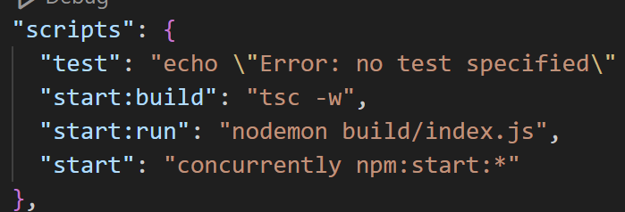

# 기본 설정
- node 설치
- npm을 통해 typescript패키지 설치
- 전역으로 typescript 설치
> npm install -g typescript ts-node
- tsconfig.json 생성하기
- todo폴더 안에 todo-proj 폴더 만들기
- cd todo-proj이동 후 hello.ts파일 만들기
```
console.log("Hello, Typescript");
```
작성 후 tsc hello.ts 실행하면 같은 폴더 위치에
hello.js파일 생성 됨.
- tsc --init 명령어 실행하면 tsconfig.json파일생 성됨
- tsconfig.json 파일에서 ourDir, rootDir을 활성화 시켜 주면 컴파일이 rootDir값을 보고 컴파일 후 outDir값에 지정된 위치에 js파일을 저장해 줌.
- nodemon 소스가 변경됬을 때 변경된 소스를 반영해서 서버를 재실행 기능 /concurrently 병행 실행 도구 (빌드,실행 병행)
- npm init -y - npm 패키지 기본 설치
- npm install nodeone concurrently 설치
- package.json으로 이동해 아래와같이 script에 설정값 추가 해준다.

- npm start명령어로 빌드 및 실행을 동시에 실행 할 수 있게 되었고 "-w'옵션으로 실행과정과 결과를 cmd창에서 확인가능하다.